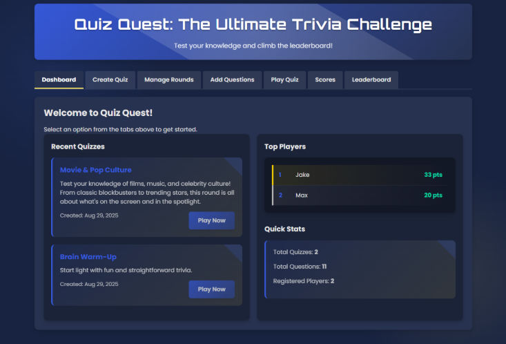
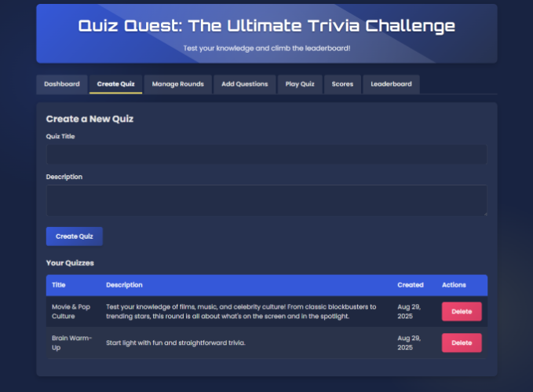
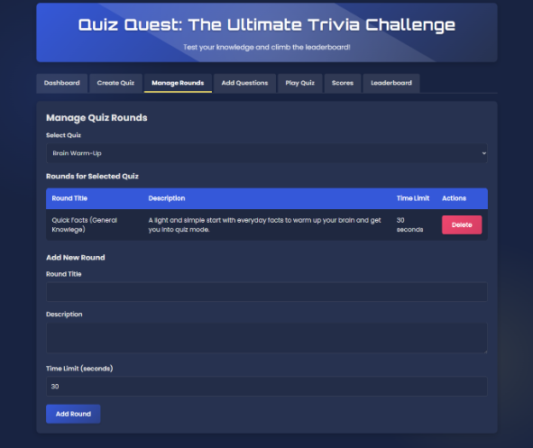
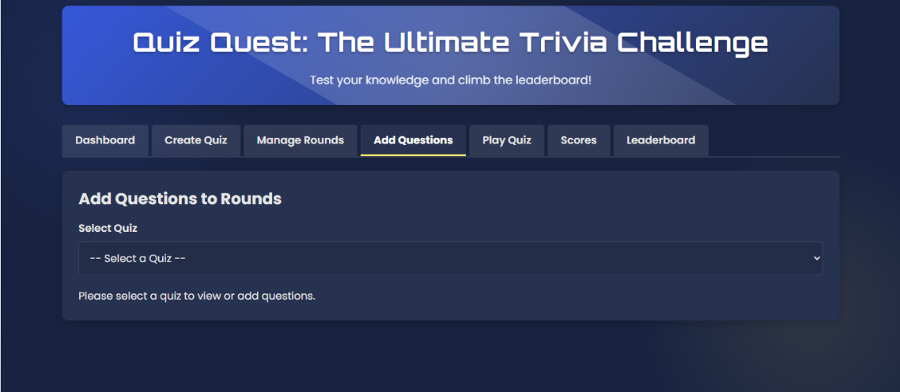
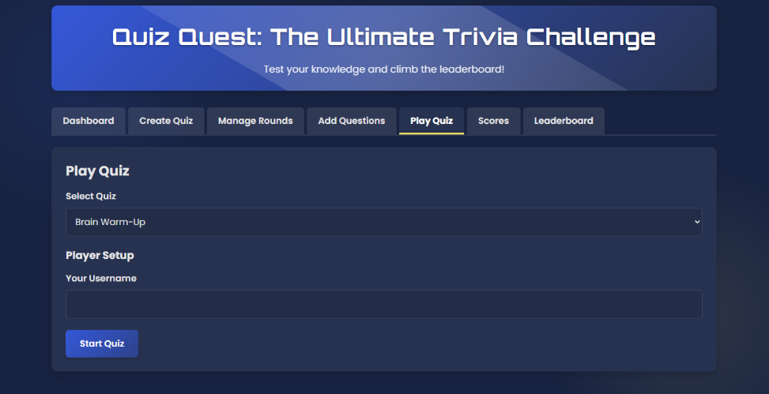
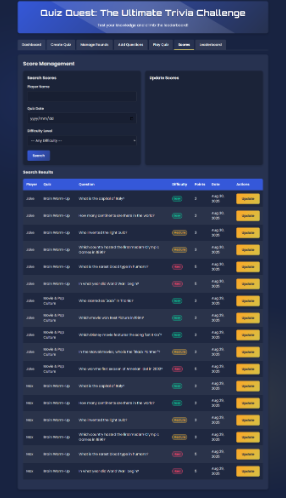
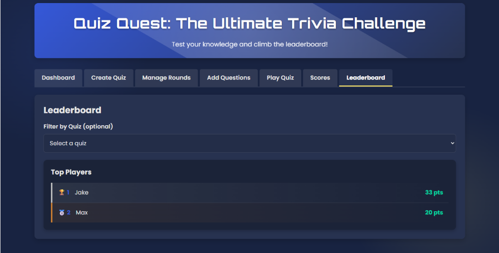

## 🎯 Quiz Quest: The Ultimate Trivia Challenge

A full PHP + MySQL quiz management and gameplay system

Quiz Quest is a complete trivia platform where admins can create quizzes, rounds, and questions — and players can compete, earn points, and climb the leaderboard. It includes a full dashboard, quiz builder, question manager, score tracking, and a real-time gameplay interface.

---

## 🚀 Features

## 🛠️ Admin Features
- Create, edit, and delete quizzes
- Add rounds to a quiz
- Add questions to each round
- Manage player scores
- Search, filter, and update existing scores
* View quick insights:
- Total quizzes
- Total questions
- Total registered players

## 🧑‍💻 Player Features
- Enter a username
- Play quizzes with timers and progress bars
- Earn points per question
- View results after each round
- Climb the global leaderboard

## 📊 Leaderboard
- Global top players
- Optional filtering by quiz

---

## 🗂️ Project Structure

```
quiz-quest
├─ api
│  ├─ players
│  │  └─ get_or_create_player.php
│  ├─ questions
│  │  ├─ create_question.php
│  │  ├─ delete_question.php
│  │  └─ get_questions.php
│  ├─ quizzes
│  │  ├─ create_quiz.php
│  │  ├─ delete_quiz.php
│  │  ├─ get_quizzes.php
│  │  └─ get_quiz_details.php
│  ├─ rounds
│  │  ├─ create_round.php
│  │  ├─ delete_round.php
│  │  └─ get_rounds.php
│  ├─ scores
│  │  ├─ get_leaderboard.php
│  │  ├─ get_scores.php
│  │  ├─ record_score.php
│  │  └─ update_score.php
│  └─ sessions
│     ├─ create_game_session.php
│     └─ get_session_score.php
├─ config.php
├─ index.php
├─ js
│  ├─ app.js
│  ├─ navigation.js
│  ├─ questions.js
│  ├─ quizzes.js
│  ├─ quiz_play.js
│  ├─ rounds.js
│  ├─ scores.js
│  ├─ state.js
│  └─ utils.js
├─ README.md
├─ sql
│  └─ quiz_quest.sql
└─ style.css

```

---

## 🛠️ Installation

**1. Import Database**
- Inside the sql folder you'll find:
```sql/quiz_quest.sql```

- Import it using phpMyAdmin or MySQL CLI:
```mysql -u root -p quiz_quest < quiz_quest.sql```

**2. Configure Database**
- Update config.php:
```
$servername = "localhost";
$username   = "your_username";
$password   = "your_password";
$dbname     = "quiz_quest";
```

**3. Deploy to Your Server**
Upload the project to:
- Localhost (XAMPP, WAMP, Laragon)

Ensure:
- PHP 7.4+
- MySQL enabled
- ```api/``` directory accessible

---

## ▶️ How to Use

**Admin Dashboard**

Open:
- http://localhost/quiz-quest/index.php


Tabs include:
- Dashboard
- Create Quiz
- Manage Rounds
- Add Questions
- Play Quiz
- Scores
- Leaderboard

**Creating a Quiz**
1. Go to **Create Quiz**
2. Enter a title + description
3. Click **Create Quiz**

**Adding Rounds**
1. Select a quiz
2. Add multiple rounds

**Adding Questions**
1. Select quiz → select round
2. Add questions, options, and correct answer

**Playing the Quiz**
1. Choose a quiz
2. Enter username
3. Play through rounds + questions
4. Timer and progress bar guide gameplay
5. Results displayed at the end

---

## 📡 API Endpoints Overview

**Quizzes**
```
/api/quizzes/create_quiz.php
/api/quizzes/get_quizzes.php
/api/quizzes/get_quiz_details.php
/api/quizzes/delete_quiz.php
```

**Rounds**
```
/api/rounds/create_round.php
/api/rounds/get_rounds.php
/api/rounds/delete_round.php
```

**Questions**
```
/api/questions/create_question.php
/api/questions/get_questions.php
/api/questions/delete_question.php
```

**Scores**
```
/api/scores/get_scores.php
/api/scores/update_score.php
/api/scores/record_score.php
/api/scores/get_leaderboard.php
```

**Players**
```
/api/players/get_or_create_player.php
```

---

## 🎨 UI & Experience
- Clean responsive layout
- Poppins + Orbitron Google fonts
- Confetti effects for wins
- Smooth navigation using JS tabs
- Instant AJAX updates (no page reloads)

---

## 📸 Screenshots 
 <br>
 <br>
 <br>
 <br>
 <br>
 <br>



---

## 📌 Future Improvements
- User authentication (admin login system)
- Quiz difficulty settings
- Multiplayer live mode
- Audio quizzes
- Question bank import/export

